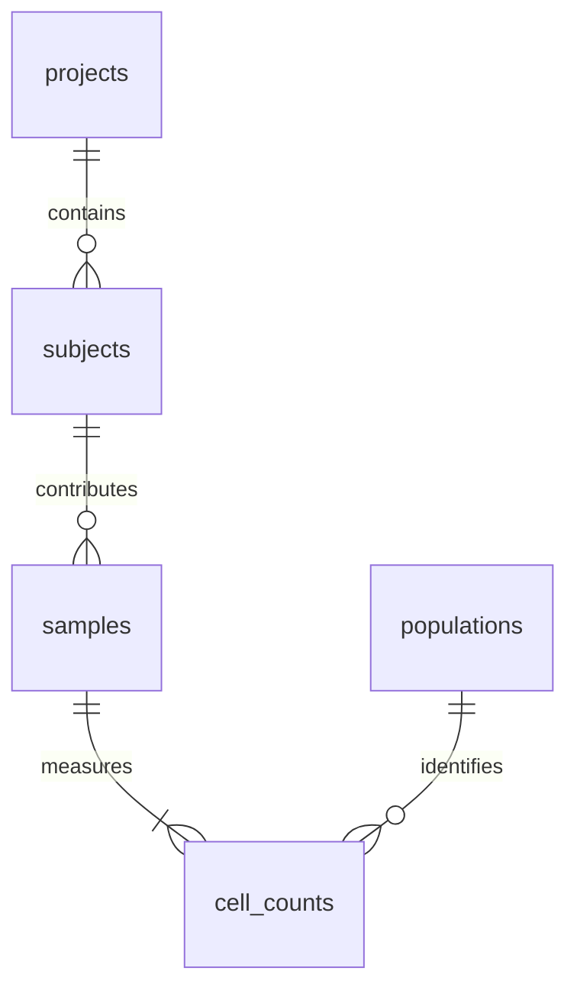

# Immune cell response analysis

A reproducible SQLite and Python pipeline with an interactive Streamlit dashboard for the Loblaw Bio trial exercise.

**Repository:** [angelapredolac/teiko-technical](https://github.com/angelapredolac/teiko-technical)

**Dashboard:** [Local dashboard](http://localhost:8501) after `make dashboard`. In Codespaces, open forwarded port **8501** from the **Ports** panel. A public dashboard URL is pending deployment; see the publishing instructions below.

## 1. Run in GitHub Codespaces

From the repository's **Code → Codespaces → Create codespace** menu, create a workspace. The supplied dev container uses Python 3.11 and automatically runs setup and the pipeline. To reproduce those steps manually from the repository root:

```bash
make setup
make pipeline
make dashboard
```

- `make setup` creates `.venv` and installs pinned dependencies.
- `make pipeline` sequentially loads the source CSV into `cell_counts.db`, runs all analyses, and writes reports to `outputs/`.
- `make dashboard` starts Streamlit on port 8501 and reads the database created by the pipeline. Stop it with Ctrl+C.

Python 3.11–3.13 is supported. On a local machine, Python and Make must be installed. Setup requires internet access; the pipeline itself does not. All file paths are resolved relative to the repository, so there is no dependency on the original Downloads folder.

The required standalone loader also works without third-party dependencies:

```bash
python load_data.py
```

It creates `cell_counts.db` in the repository root without arguments. The input `cell-count.csv` is included in the repository.

## 2. Database design



| Table | Key | Stored information |
| --- | --- | --- |
| `projects` | `project` | Project identifiers |
| `subjects` | `subject` | Project, condition, age, sex, treatment, response |
| `samples` | `sample` | Subject, sample type, treatment-relative time |
| `populations` | `population` | Five measured population names |
| `cell_counts` | `(sample, population)` | Nonnegative integer cell count |
| `provenance` | One row per database build | Source filename, SHA-256, source row count |

This separates subject attributes from repeated visits and avoids a new count column whenever a population is added. The loader currently enforces the exercise's five-population CSV format. Subject IDs are assumed globally unique; inconsistent attributes, including project membership, are rejected instead of merged. Age is stored as supplied at subject level because it is constant across the provided visits.

Foreign keys, primary keys, category checks and nonnegative counts enforce relational integrity. Indexes support subject joins and cohort selection. Blank response is stored as SQL `NULL`, never as non-response. Unknown response subjects remain available in the database.

The loader validates every row, rejects duplicates, fractional/negative counts, missing required fields, inconsistent subject metadata, empty files and zero-total samples. It builds a temporary database and atomically replaces the previous file only on success. Reruns do not append duplicates. A zero-total percentage is undefined; the SQL view also uses `NULLIF` defensively.

### Part 2: sample frequencies

The `sample_frequencies` SQL view returns precisely:

```text
sample | total_count | population | count | percentage
```

For each sample, `total_count = SUM(count)` across the five populations and `percentage = 100.0 * count / total_count`. Stored counts remain the source of truth; percentages are computed rather than redundantly stored. Percentages sum to approximately 100% per sample, subject to floating-point precision.

### Part 4: baseline subset

`baseline_samples` applies all four filters in SQL:

```sql
WHERE condition = 'melanoma'
  AND treatment = 'miraclib'
  AND sample_type = 'PBMC'
  AND time_from_treatment_start = 0
```

Project summaries use `COUNT(*)` for **samples**. Response and sex summaries use `COUNT(DISTINCT subject)` for **subjects**, so additional baseline samples do not inflate patient counts.

## 3. Statistical approach

Part 3 includes melanoma patients receiving miraclib, PBMC samples only, and known `yes`/`no` response. All five populations are analyzed.

1. The required boxplots show sample relative frequencies by response for every population. The dashboard can also plot subject means.
2. Each subject has repeated samples. The primary comparison averages each population's percentages within each subject across available visits, then compares independent subjects with a **two-sided Mann–Whitney U test** (asymptotic tie correction and continuity correction).
3. **Holm correction** controls the family-wise error rate across the five population tests at 0.05 and allows dependent tests. Significance means adjusted p < 0.05.
4. Report group sizes, medians, median differences in percentage points, U statistics, raw/adjusted p-values and **rank-biserial correlation**. Positive correlation indicates larger responder frequencies. A distributional test does not generally test medians alone.
5. A separate exploratory **baseline-only** comparison addresses potential pretreatment predictors. Correction is applied separately within each window; searching both windows adds multiplicity beyond one family.

Subjects with fewer visits still receive equal weight, but their means summarize different available time windows. The supplied data has visits at 0, 7 and 14 for every subject. Groups with fewer than two subjects are marked untestable. No predictive model is claimed.

### Interpretation limits

These are exploratory associations, not evidence that the drug caused a change. Post-treatment measurements could reflect response rather than predict it. Cell fractions are compositional: a higher fraction can result from another population decreasing. Project, age, sex and other confounders are not adjusted for. A future prediction study would use baseline features, split data by subject, evaluate on held-out subjects and consider project effects. A longitudinal model would be needed to estimate response-specific trajectories.

References: [SciPy Mann–Whitney U documentation](https://docs.scipy.org/doc/scipy/reference/generated/scipy.stats.mannwhitneyu.html); [Holm's original sequential correction paper](https://www.jstor.org/stable/4615733).

## 4. Outputs and dashboard

`make pipeline` creates:

- `cell_counts.db`: all source rows as relational data, views and provenance.
- `outputs/sample_frequencies.csv`: all 52,500 sample–population rows.
- `outputs/statistics_all_timepoints.csv` and `statistics_baseline.csv`: statistical evidence.
- `outputs/subject_frequencies_*.csv`: the observations used by each statistical comparison.
- `outputs/response_boxplots.html`: standalone interactive boxplots, including Plotly for offline viewing.
- `outputs/baseline_*.csv`: matching samples and all three requested summaries.
- `outputs/results.md`: generated statistical report.

Dashboard tabs cover the sample overview, response comparison, baseline cohort and methods. Tables are downloadable; overview filters allow project selection and sample search. Response comparison has explicit analysis-window and plotting-unit controls. Baseline summaries always represent the full requested cohort.

For the supplied file, the baseline subset contains **656 samples / 656 subjects**:

| Measure | Category | Count |
| --- | --- | ---: |
| Samples by project | prj1 | 384 |
| Samples by project | prj3 | 272 |
| Subjects by response | yes | 331 |
| Subjects by response | no | 325 |
| Subjects by sex | M | 344 |
| Subjects by sex | F | 312 |

Projects with no matching samples do not appear in grouped results.

### Findings for the supplied data

No population meets the Holm-adjusted p < 0.05 threshold in either analysis.
For the all-timepoint subject means, CD4 T cells have the smallest raw p-value
(0.0124), but the adjusted p-value is 0.0621. The responder median is 30.210%
versus 29.823% in non-responders, a difference of 0.387 percentage points;
rank-biserial correlation is 0.113. All baseline adjusted p-values are 1.0.
Failure to detect significance does not establish equivalence between groups.
Exact values are reproduced in `outputs/results.md`.

## 5. Quality checks

```bash
make lint
make test
```

Tests check independent percentage calculations, complete import, rerun behavior, database integrity, missing responses, failure preservation, invalid data, distinct-subject counting, known Holm values, subject weighting, effect direction and Streamlit interactions. GitHub Actions runs lint, the entire pipeline and tests in Python 3.11.

## 6. Publish the repository and dashboard

Commit the source files, source CSV, configuration and tests. Generated databases, environments and reports are intentionally ignored; they are reproducible with `make pipeline`.

For an empty local repository without a remote:

```bash
git remote add origin https://github.com/angelapredolac/teiko-technical.git
git add .
git commit -m "Implement immune cell analysis pipeline and dashboard"
git branch -M main
git push -u origin main
```

If the remote already contains commits, fetch and reconcile them first; do not force-push. GitHub authentication may be required.

To provide a persistent public dashboard link:

1. Sign in to [Streamlit Community Cloud](https://share.streamlit.io/) with your GitHub account.
2. Create an app for `angelapredolac/teiko-technical`, select the published branch and **`cloud_app.py`** as the entry point, and select Python 3.11 in advanced settings.
3. Deploy. The cloud entry point initializes the same database and analysis pipeline if no database exists, then displays `app.py`. Locally, `make dashboard` uses `app.py` directly and expects `make pipeline` to have run.
4. Open the deployed app, check each tab, and replace the pending public dashboard notice at the top of this README with its actual URL.
5. Submit the repository link after the public dashboard link is recorded.

See [Streamlit's deployment instructions](https://docs.streamlit.io/deploy/streamlit-community-cloud/deploy-your-app/deploy). No public URL is claimed until deployment succeeds.
